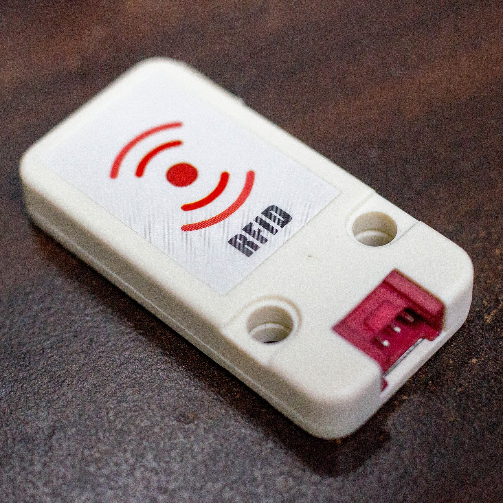
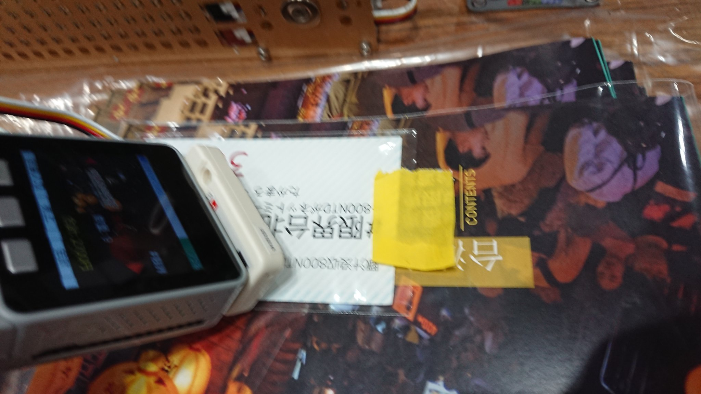

---
title: M5Stackで即売会レジを作る
subtitle: Ver1.1
toc-title: 目次
...

## Ver 1.1 発刊にあたって

初版はC97の1週間前である12月21日 (月) から着手し、1日目である28日 (土) に二俣川で脱稿して横浜のキンコーズで慌てて印刷しました。
3日目の30日 (月) の頒布ではレジ実機とともに大きな反響を頂き、閉会を待たずに完売となりました。
この結果からより多くの方にお読み頂きたいと判断し、C98に申し込むことを決意しました。

C98での発刊に当たってはVer 1.1と称し、解説を加筆しています。
初版ではあまり紙面を割けなかった、M5Stack各種モジュールや環境構築、ソフトウェア実装などの解説を増量しました。
なお初版の内容はほぼ全て含んでいるため、読み返さなくても問題ありません。

またレジ本体も時計機能とそれに連動した売上一覧の出力機能の実装など、機能強化を行っています。
みなさまのサークルでの会計処理迅速化に少しでも役立てていただければ幸いです。

## まえがき

同人誌即売会での売上計算って悩ましいですよね。
App Store やGoogle Playを検索するとレジアプリは多数見つかりますが、釣銭計算機能があるために毎回金額を入力するのが結構煩雑です。
売上入力より頒布物が出るペースのが速く、売上計上が間に合わなかった経験もあります。

コミケでは高速入力に耐えうるテンキー付きのキャッシュドロアーや、バーコードスキャンが可能なPOSを持参する猛者も見かけます。
「小型で手軽に扱えるレジはないかな」と思いますが、ハンディターミナルは業務用であり非常に高価です。

そこで2019年8月に出会ったのがM5Stackでした。
Wi-FiとBluetooth内蔵でリソースも潤沢なESP32マイコン、液晶などマイコンボードでは別に用意する部材がケースに組み込まれていて4000円前後。日本発売から1年が経過して情報も揃ってきたことから「これでレジ作れるのでは?」と閃き、翌9月にはAliExpressで部材を発注していました。

## M5Stackとは？

### 概要

中国深圳市のM5Stack社が発売しているESP32 [^1]ベースのマイコンボードです。
ホビイスト向けのマイコンボードはArduino (https://arduino.cc/) を始め多種多様な製品が世に出ていますが、大きな特徴として **周辺デバイスを内蔵してケースに入っており、積み重ねられる** 点があります。
電子工作で意外と手間のかかる半田付けやブレッドボードの使用をスキップでき、本体だけでも遊べるように出来ています。
また早期から日本市場での展開を想定していたようで、主要製品は技術基準適合証明を取得しています。

ESP32自体にArduino IDEで開発できるライブラリが用意されていますが、 M5Stackではそれとは別に、既存のOSSライブラリを活用した内蔵デバイスを扱いやすくするためのライブラリ一式が用意されています。

製品改良のサイクルが非常に早く、**ロットによって仕様が予告なく変更される**ことが多々あるので購入時は注意が必要です。
公式Webサイト (https://m5stack.com/) の情報すら古くなっていることもあり、各自で情報収集が求められることからArduinoでの開発に慣れた人向きのデバイスと言えます。

|スペック|詳細|
|:--|:--|
|定格電圧|3.3V|
|CPU|ESP32 (Xtensa LX6 240MHz 2コア)|
|RAM|520KB|
|I/F|I2C x2, SPI x2, UART x3, ADC, DAC など[^2]|
|無線|Wi-Fi + Bluetooth (Classic, BLE)|

[^1]: 中国Espressif社が開発した無線機能内蔵の32bitマイコンです。 ESP8266の後継機で、マイコン単体では500円前後と非常に安価なことが特徴です。

[^2]: ESP32のI/Oはこれだけ用意されていますが、 M5Stackの内蔵デバイスで一部が消費されており内部ピンソケットには一部のピンが引き出されていません。

### モジュール各種

{height=2cm}
{height=2cm}

本体は基本的にCore (写真左) とBottom (写真右) のセットで販売されており、間にModule (写真中央。これはPlus Module) を積み重ねて機能を拡張する仕組みになっています。
本体の各モジュールには専用品のピンヘッダ/ピンソケット (M-BUS) が実装されており、面倒な結線が不要なよう工夫されています。
積み重ねたモジュールは側面の穴からマイナスドライバーを入れてこじ開けると取り外せますが、M-BUSを壊すおそれもあるので慎重に開けて下さい。

本項目では筆者の所有するモジュールを中心に紹介していきます。

#### Core

{width=4cm}

機能の違いで3種類あります。
どの本体にも320x240 16bit カラー液晶[^3]、スピーカー、ボタン3個、 Grove互換ポート[^4] ポートA (3.3Vロジック)、Micro SDカードスロットが搭載されてケースに入っています。

本体はCore + Bottomのセットで販売されており、間に Moduleを積み重ねたり、Grove互換ポート ポートAでUnitを接続して拡張していく仕組みです。

- Black (写真左)
  - 基本的なM5Stackです。
  - 150mAのリチウムイオン電池を内蔵したBattery Bottomが付属します。
- Gray (写真右)
  - Black Coreに加え、9軸IMU[^5]が入っています。
  - Gray 単体のBattery Bottomは Black の色違いです。
  - FacesやM5GOのキットに入っている本体はこれと同じですが、独自のBottomが付きます。
- Fire
  - Gray Coreに4MBのPSRAMが追加されています。
  - BottomはM5GOと同じものが付属します。
  - リソースを消費しがちなMicroPyhthon (UI Flowへ移行)やUI Flowでの開発向けです。

|種類|Black|Gray|Fire|
|:--|:--:|:--:|:--:|
|Flash|4MB|4/16MB[^6]|16MB|
|PSRAM|-|-|-|
|IMU|-|○|○|
|国内価格|3,575円|4,290円|6,325円|

[^3]: TN液晶のロットとIPS液晶のロットが混在しています。視野角が異なり、 IPS 液晶は斜めから見ても色の変化が少ないです。

[^4]: 中国Seeed社が提唱するモジュールの接続規格。M5StackではI2C接続のポートA (赤)、GPIO接続のポートB (黒)、UART接続のポートC (青) に色分けされて分類されている。

[^5]: ロットにより、 MPU6886 (I2Cアドレス `0x68`) またはSH200Q (I2Cアドレス `0x6C`) のいずれかが内蔵されています。

[^6]: ロットによってフラッシュメモリの容量が異なります。 これはESP32自体の仕様です。

##### Faces

{width=4cm}

各Coreのセットとは別に**M5Stack Faces**というキットが用意されています。

キットにはGray Coreに専用Bottom (写真中央) と、Gameboy (写真右上) 、Calculator (写真右下) 、Keyboard (写真左上) の3種類のPanelと、充電ベース (写真左下)[^7] が付属しています。

Panelは下記4種類のPanelがオプションとして販売されています。セット付属Panelの単品販売はまだ無いようです。

- Encoder Panel
- RFID RC522 Panel
- Finger Print FPC1020A Panel
- Joystick Panel

{width=4cm}

ちなみに Panel には ATMega328P が載っており、押したボタンに対応したコードを I2C で通信するプログラムが予め書き込まれています。
この部分だけを書き換えることも可能です。

Facesは日本では流通量が少なく、入手しづらいです。
AliExpressの公式ストアでFire共々よくセール対象になる商品でもあり、個人輸入を検討する価値があります。

[^7]: 筆者の個体ではポゴピンの接触が悪く、 充電できず…

#### Module

##### PLUS Module

{width=4cm}
{width=4cm}

複数のI/Oやバッテリが一纏めになったModuleです。
後述のM5GO Baseを使わずともポートB/CのGrove互換ポートを使用することが出来ます。

- Grove互換ポート ポートB (GPIO)
- Grove互換ポート ポートC (UART)
- 赤外線トランスミッタ
- ロータリーエンコーダ
  - I2C接続のATMega328経由 (I2Cアドレス `0x62`)
- リチウムイオン電池 500mAh
- マイク用パターン

##### Proto Module

{width=4cm}
{width=4cm}

M-BUS装着済みのユニバーサル基板のModuleです。
M-BUSのピンはスルーホールに引き出されていないため、自分で配線します。

ケースにはケーブル類を通す穴やスリットが設けられています。
筆者はこの穴にヒートンをねじ込み、紐を通して首にぶら下げられるようにしています。

#### Base

M5Stack公式では底面モジュールをBottom、充電ドックをBaseと呼称しているようです。

##### Battery Bottom

{width=4cm}
{width=4cm}

Black/Grayのセットを購入すると付属する、150mAリチウムイオン電池入りのBottomです。実はM5Stack直販にて単品購入も可能です。
上下左右にピンヘッダ/ピンソケットでI/Oが引き出されています。
バッテリ容量が少ないので、長時間駆動の時は別途バッテリ入りのModuleまたはBottomを用意すると良いです。

バッテリ入りのModule/Baseを複数使用すると電池が並列接続となり、容量の少ない方が過充電になるおそれがあります。
保護回路が入っているそうですが、念のため電池を取り去って使用しています。

##### M5GO/Fire Battery Bottom

{width=4cm}
{width=4cm}

下記の機能が載ったBaseです。
Basic/Gray付属のBaseとは異なり、ピンヘッダ/ピンソケットは引き出されていません。
Battery Bottomとは高さが異なるため、四隅のボルトは異なる長さのものを要します。

- Grove互換ポート ポートB (GPIO) / ポートC (UART)
- NeoPixel互換フルカラーLED x10
- リチウムイオン電池 550mAh
- マイク
- 充電ドック用ポゴピン

レゴ互換の凹凸や穴が開けられ、M3ネジ穴も切られています。

国内ではM5Stack FIREまたはM5GOセットの添付品でのみ入手できますが、M5Stackl直販では充電ドックの付かない単品販売があります。

##### M5 Faces Bottom

{width=4cm}
{width=4cm}

Facesのセットに付属する専用のBottomです。
縦長形状で600mAhのバッテリが内蔵されており、さらに下部のPanelが交換可能となっています。

後にM5 Faces IIが発売されましたが、執筆時点ではFacesキットの同梱はなく単体販売のみです。

- M5 Faces
- M5 Faces II
  - Grove互換ポート B (GPIO) / C (UART)
  - NeoPixel互換フルカラーLED x10
  - ピンソケット/ピンヘッダの引き出し廃止
  - 基板がスルーホール付に変更
  - ボルト用の穴が2個増加

#### Unit

##### Mini GPS/BDS Unit

{width=4cm}
{width=4cm}

AT6558とMAX2659を搭載したGPS Unitです。
M5StackのGPSは2種類あり、他にNEO-M8Nを搭載した本体に積み重ねる**GPS Module**が発売されています。

9600bpsのUARTで通信するので、Grove互換ポートは**ポートC**に接続します。
測距データはNMEAフォーマットのテキストデータで送られてきます。
Arduino用のパーサを使うとデータの取り出しが楽です。

- TinyGPS
- TinyGPS++
  - TinyGPSのオブジェクト指向版

##### RFID Unit (日本未発売)

{width=4cm}
{width=4cm}

MFRC522を搭載しており、13.56MHzのRFIDを読み取ってUUIDなどをI2C (アドレス: `0x28`) で送出します。

ArduinoのリポジトリにもMFRC522ライブラリはありますが、SPIで通信することからI2C接続のRFID Unitでは使用できません。
M5StackのサンプルコードでI2C制御版が用意されています。

##### I2C Joystick Unit

{width=4cm}

ジョイスティックを搭載したUnitです。
ATMega328Pに接続されており、I2C (アドレス: `0x52`) で値が送出されます。

値を読み込む際は3バイト送出要求を送るとX軸、Y軸、押し込みの順番で送出されます。

ジョイスティックの反射による映り込みが激しいため写真は裏面のみです。

##### 2.54mm Proto Unit

{width=4cm}
{width=4cm}

ユニバーサル基板が取り付けられたUnitです。
基板はボルトを外してケースを分解すると取り出せます。

Grove互換ポートはポートBと同じ黒色ですが、当然ながら結線は指定されていません。

### 姉妹品

#### M5StickC

{width=4cm}
{width=4cm}

ESP32-PICOが搭載された小型版です。
Wi-Fi、Bluetoothを含めマイコンの性能に差はありませんが、装備するI/Oがかなり異なります。
後発ゆえにM5Stackより強化された機能もあります。

写真では温湿度、気圧、磁界センサを搭載したENV HATを取り付けて気圧計として動作させています。

- 変更されたI/O
  - 0.96インチカラー液晶 (80x160)
  - ボタン: 2個
  - リチウムイオン電池 80mAh
  - USB-シリアル変換: FTDI製
    - 1.5Mbpsで通信できる
  - ピンソケット: 8ピンのみ
    - M5StickC専用のHATが取り付け可能
    - ピン数の少なさからSPIの使用は困難
- 追加されたI/O
  - 赤色LED、赤外線トランシーバ
  - マイク SPM1423
  - RTC BM8563
  - 電源管理IC AXP192
    - 液晶バックライトもこちらで制御
- 削除されたI/O
  - MicroSDカードスロット
  - スピーカー

ライブラリはM5StickC用のものが別途用意されています。
M5Stack用に書かれたプログラムはコードレベルで移植できることも少なくないですが、変更された機能を使っていると修正が求められます。

#### M5StickV

{width=4cm}
{width=4cm}

KPU (ニューラルネットワークプロセッサ) を内蔵したKendryte K210を搭載したAIカメラで、単体で画像認識などが行えます。

||スペック|
|:--|:--|
|定格電圧|3.3V|
|CPU|Kendryte K210 (64bit RISC-V 400MHz 2コア)|
|RAM|8MB|
|Flash|16MB|
|I/F|I2C, SPI, UART, 内蔵RTC, PWM|
|無線|無し|

- カラー液晶 135x240
- カメラ OC7740
- ボタン: 2個
- RGBW フルカラーLED
- IMUセンサ MPU6886 (またはSH200Q)
- 電源管理IC AXP192
- マイク MSM261S4030H0
  - 不具合のため動作しない
- MicroSDカードスロット
  - 電源管理ICとの絡みで電圧降下時に読み書きが不安定になるらしく、カードによって相性が激しい
- リチウムイオン電池 200mAh
- Grove互換ポート
- USB Type-Cポート
  - USBシリアル変換: FTDI製

CPUアーキテクチャから異なることから**他のM5Stackシリーズとはほぼ別物で、Sipeed Maixシリーズに近い製品**です。
開発環境もMaixシリーズ向けのMaixPyを使用してMicroPythonで行うのが基本です。

ファームウェアに顔認識機能が組み込まれており無設定で動くほか、起動時にMicroSDカードの `boot.py` を読み込む仕様となっています。
推論モデルは `kmodel` 形式が使用でき、クラウドベースでモデルを作成してくれる**V-Training**というサービスが用意されています。
TensorFlow Lite形式のモデルを自前で用意してnncaseで変換しても作成できますが、まだ情報が少ないです。

**Wi-FiやBluetoothなどの無線機能は非搭載**です。
無線機能を搭載したM5StickV+が予告されており試作品まで出たそうですが、製品化はキャンセルされたとのことです (https://twitter.com/M5Stack/status/1218339505200975872) 。

### オプション

#### 充電スタンド

{height=3cm}
{height=3cm}

Baseの下部ピンヘッダに接続する端子が付いたスタンドで、電源線のみがUSB Type-C端子と結線されています。
DHT12温湿度計 (アドレス `0x5C`) がI2Cバスに接続されています。

公式サイトの写真ではL字のUSB Type-Cケーブルが掲載されていますが、購入した個体はストレートのケーブルでした。

#### RFIDカード (日本未発売)

{width=4cm}

13.56MHzのRFIDカード (Mifare規格) です。
UUIDは4バイトのようです。

筆者はhareta (@haretter) 氏から「カード買ったら?」と言われるがままに購入しました。
RFIDカード自体は日本でも入手は難しくないのですが、これは5枚200円台少々であることから安価です。

2019年11月に他の商品を注文した時は別の絵柄のカードを1枚オマケで付けてくれました。

#### NeoFlash アクリルライトボード (日本未発売)

{width=4cm}
{width=4cm}

192個 (横24個 x 縦8個) のNeoPixel互換RGB LEDとPIRセンサが搭載されたアクリルボードです。
LED基板は前後をプラ板で覆われており、これが薄く割れやすいため扱いには注意を要します。
幅は約22cmとM5Stackの中では大型なオプションです。

M5Stack本体とはGrove互換ポートのうち**ポートB**を接続しますが、ケーブルは上向きに出ています。
このため**ケーブルを延長しない場合はPlus Moduleでは配線できず、M5GO Baseが必要**です。
本体を固定するネジ穴もM5GO Baseに合わせられています。

別にポートAに接続するケーブルも引き出されており、ボード右端に3ポートあるポートAのハブとして使えます。

192個のLEDは1行目左端～1行目右端、2行目左端～2行目右端、の順に接続されており、**マトリクス状の接続ではありません**。
制御はNeoPixelライブラリでは速度に限界があるようで、FastLED (https://github.com/FastLED/FastLED) ライブラリの使用が推奨されています。

{width=4cm}

C97用に即興で行先表示器を作って遊んでいました。
LEDは縦8ドットですから美咲フォント (https://littlelimit.net/misaki.htm) がぴったり合います。
3文字まで一度に表示できます。

#### M3ボルトセット (日本未発売)

{width=4cm}

12mm、18mm、25mm、32mmのボルトと2.5mmの棒レンチのセットです。
ボルトは本体やオプションにも付属しており, 積み重ねたモジュール類を締めて固定できます。
**長さを間違えたり締めすぎると液晶のガラスパネルが浮き上がる**ので、適切な長さのものを使って下さい。

ボルト自体はホームセンターでも売っています。近所で探したところ、10mm、12mm、15mm、20mm、25mm…といった長さは見つかりますが、基本的に5mm単位で18mmや32mmといった長さはあまり置いていません。

他の商品を輸入するタイミングで1つ買っておくと何かと便利です。

#### ガラスパネル修理キット (日本未発売)

{width=4cm}

M5Stackのガラスパネルやボタンを破損したときのための交換パーツです。
液晶を取り外すための吸盤も付いています。

これも他の商品と一緒に買っておくと何かと便利です。

### 購入先

製品としては電子部品の範疇に入るので、必然的にそのような部材を扱う店舗で購入します。

- 国内販売
  - スイッチサイエンス (https://www.switch-science.com/)
    - スイッチサイエンス製品を取り扱う電子部品店 (千石電商、共立電子、マルツパーツ館など) でも購入できます。
    - ツクモなど、 IoT デバイスを扱うパソコンショップにも取り扱いがあります。
    - 結構人気らしく、頻繁に在庫がなくなります。
- 個人輸入
  - m5stack-store (https://m5stack.com/)
  - AliExpress M5Stack Official Store (https://m5stack.aliexpress.com/store/3226069)
    - 商品改良のサイクルが非常に速いことから日本未発売の商品も多数あり、手を出していくと必然的に個人輸入を行うことになります。 **個人輸入は自己責任で**。
    - 上記2店はメーカー直販です。ほか中国通販サイトには再販業者も多数あるようで、実態を掴みきれていません。

筆者が確認したところ、台北市内の主要な電子部品店 (今華電子など) では取り扱いが無かったです[^8]。

[^8]: なんでも台湾のメイカー市場では Arduino と Raspberry pi がメインストリームで、他のボードはマイナーな域を出ないようです。日本の方がはるかに多くの種類を取り扱っています。

## ハードウェア選定

部材選定についての経緯は後述します。

- M5Stack Basic: 3,575円
  - Basic Core
- M5Stack Faces: 5,285円
  - Faces Bottom
  - Gameboy Panel
- M5Stack MFRC522 RFIDリーダ: 957円
- M5Stack Proto Module: 284円
- M5Stack RFIDカード 5枚組:  216円
- Adafruit PCF8523 RTCモジュール: 704円

総額11,021円。
Black Coreが必要になってしまったため随分と値が張ってしまいました。

### 本体

C97でお披露目したときは手元にあるGray Coreを使用していました。
C98では後述の時計機能搭載の関係でBasic Coreに制限され、Coreを変更しています。

### ボタン

詳しくはソフトウェアの項目で説明しますが、ガラケーのUI風に画面を切り替えるボタンを配置すると、Coreの3ボタンはこの用途だけで使い切ってしまいます。
商品や数量を切り替えたりリセットするには不十分です。

レジの構想時にちょうどAliExpressの公式ストアでM5Stack Facesがセール対象となっており、白羽の矢が立ちました。
カーソルキーと複数のボタンがあれば十分と判断し、Gameboy Panelを使用します。

### 時計機能

C97終了後にありま秀丞 (@shuujou_arima) 氏から
「時計機能を付けてCSVに書き出すと売上の傾向が分かって便利」
というコメントを頂きました。

経過時間程度ならTimer機能で値をカウントすれば済むのですが、時刻を保持するならI2Cなどで接続する**RTC** (Real Time Clock) というICが必要になります。
RTCにバックアップ電池を接続すると、本体の電池が切れても時刻が保持されます。

しかし、M5StackはRTCを内蔵していません (M5StickCでは内蔵)。
自分で選定して接続してあげる必要があります。
外付けするのも不格好なので、最終的にはProto Moduleに半田付けして積み重ねることで本体と一体化させてしまいます。

#### 3.3V駆動のI2C

プロトタイピングに便利なRTCモジュールは各社から多数発売されています。
ここで注意する点として、**ESP32のI/Oは3.3V駆動**です。
しかも**5Vトレラントではない**らしく、Arduinoでは定番といえるMaximのDS1307のような5V専用のRTCは使えません。
I2Cは双方向に信号が流れるので、レベル変換ICを挟まないと最悪の場合壊れてしまいます。

{width=4cm}
{width=4cm}

今回は3.3V/5V両対応の**NXP PCF8523**を使用しました。
Adafruitがモジュール (https://www.switch-science.com/catalog/3037/) を商品化しており、これをポン付けします。

ちなみにバックアップ電池はコイン型リチウム電池では多少マイナーなCR1220を採用しています。
入手しやすくて安価なのはダイソーで2個100円で取り扱っている三菱製でしょうか。

{width=4cm}

先ずはジャンパワイヤで結線して動作を確認して、大丈夫そうならProto Moduleに半田付けしてしまいます。
Proto Moduleであっても**M-Busと呼ばれるM5Stack独自の表面実装ピンヘッダへは配線が引き出されていません**。
基板の端に配線を回す必要があることから、スズメッキ線の他に半田ごての熱で被覆が溶けるポリウレタン銅線を使用しました。
ESP32 ArduinoデフォルトのI2Cである `Wire` は21 (SDA)、22 (SCL) ピンに引き出されているので、ここと3.3V、GNDを結線します。

{width=4cm}
{width=4cm}

#### I2Cアドレス重複問題

それではBaseにModuleとCoreを積み重ねていきます。
Faces付属のGray Coreを使いたいところですが、内蔵IMUセンサの**MPU6886とPCF8523のI2Cアドレスが0x68で被ってしまう**という大きな問題があります。
IMUセンサがSH200Qの個体ではI2Cアドレスが0x6Cのためこの問題は発生しませんが、新品では入手困難です。

解決策はいくつかあります。

- IMUセンサ非搭載のBasic Coreを使う
  - ハード、ソフトともに無改造で出来るため一番楽
  - Coreをもう一つ購入するため費用はかかる。Gray Coreを外してBasic Coreを装着する
- ESP32の2系統目のI2Cバスを使用する
  - 完成後に、紅樹 タカオ (@mongonta555) 氏から教えてもらった方法。
  - ESP32 Arduinoでは `Wire1` へのピン割り当てが未定義のため、 `Wire1.begin(SDA, SCL)` 関数でGPIOピンに割り当てて使う。
  - もともとESP32のI2C回路は高速通信用のピンには固定されておらず、どのGPIOピンでも扱える。
- SCLまたはSDA信号をアドレスの重複するデバイス間で別々に持つ
  - 2本目の信号はソフトウェアで実装する

今回の作例では早期の完成を優先したため、Basic Coreで作ってしまいました。

ピンヘッダと電池ボックスの高さがあるためか、Coreを積み重ねた時の高さがギリギリです。
ボルトを締めて固定してしまいます。

{width=6cm}

Proto Moduleを積み重ねるとCoreとPanelはツライチではなくなり、一段盛り上がります。
副次的に本体を分解せずともMicroSDカードを取り出せます (高さがギリギリなので棒で押して取り出すと良いです)。

### RFIDリーダ

純正のMini RFID Unitをそのまま使用します。
本体のGrove互換ポート **ポートA**にケーブルを介して接続します。

困るのは本体との固定方法で、**UnitにはLEGO互換の穴は開いていますがM5GO Baseでない限り本体側は固定が考慮されていません**。
考えうる方法をいくつか試しましたが、当日何も考えずに両面テープで固定したときが最も良好な結果を得られました。

- 本体、Unit共にマグネットテープを貼る
  - マグネットテープ同士では吸着力が足りない
- Coreの内部にネオジム磁石を取り付け、Unitにマグネットテープを貼る
  - Coreに仕込んだ磁石とBase内蔵の磁石が反発して外れてしまう
- 両面テープで固定する
  - C97当日に急遽両面テープを切って本体とUnitを貼り付けた
  - 結局これで問題なかった

## ソフトウェア開発

ハードウェアが決まればあとはコード記述あるのみです。

紙面の関係で本書では一部を除きソースコードを割愛しています。GitHubにリポジトリ (https://github.com/nnm-t/m5stack-sokubai-pos) を置いていますので合わせてご覧ください。

### 開発環境構築

Arduino Core for ESP32 (https://github.com/espressif/arduino-esp32) で開発しました。
公式のArduino IDE はコードヒント機能もなくエディタ機能が貧弱なので、コードはVisual Studio Code + Arduino Pluginで書いていきます。

|設定項目|設定値|
|:--|:--|
|Board|M5Stack-Core-ESP32|
|COM ポート|M5Stack の接続先|
|通信速度|921600bps|
|ライブラリ|M5Stack, ArduinoJson, RTClib|

**Arduino 言語**なんて呼ばれていますが中身はC++そのものです。
Arduino ESP32ボードのコンパイラはGCC 5.2系とやや古いですが、C++ 11でがっつりクラスを書いていきます。

STLも使った範囲では用意されているようです。
ヒープを使ってしまうとはいえ、泥臭い生配列の操作をしなくて良いのは便利です。

#### USB-シリアル変換ドライバ導入

M5StackではUSB-シリアル変換チップに**Silicon Labs CP2104**を採用しています。
ドライバは
https://jp.silabs.com/products/development-tools/software/usb-to-uart-bridge-vcp-drivers
から入手できます。
Windows 10では接続時にインボックスドライバが自動導入されますが、動作が不安定な際は入れ替えてみて下さい。

これは大人の科学で扱われたJapanino (https://otonanokagaku.net/japanino/) でも話題になったのでご存じの方も多いと思いますが、CP210xは**Macからプログラムを書き込んだ後にリセット信号がうまく送られない**という不具合があります。
書き込み後にCoreのリセットボタンを押したり、書き込み時にリセットボタンを長押しするなど苦労されるようです。
M5StickCではUSB-シリアル変換チップ自体がFTDI FT232に変更されており、改善されています。

#### 開発環境構築

Arduino公式 (https://www.arduino.cc/) から Arduino IDEを入手してインストールを済ませます。
基本的に画面の指示に従っていけば問題ありません。

これが仕様変更の激しいM5Stackの難しい所なのですが、**紙のマニュアルに記載の手順はもう古いです**。
ボードマネージャのURLはすでに変わっています。
ここでは執筆時点の手順を紹介します。

`ファイル -> 環境設定` を開き、 `追加のボードマネージャのURL` の右のアイコンを選択して複数のリポジトリを登録する画面を表示させます。
一覧の新しい行に `https://raw.githubusercontent.com/espressif/arduino-esp32/gh-pages/package_esp32_index.json` を追加します。

`ツール -> ボード -> ボードマネージャ` を開き、 `タイプ` を `提供された` (Contributed の直訳) に変更します。
`esp32` という項目があるので、 `インストール` を実行します。
GCCなどツールチェイン一式を含むため100MB単位でダウンロードを行います。

`スケッチ -> ライブラリをインクルード` で検索ボックスに**m5stack**と入力すると `M5Stack` ライブラリが絞り込まれます。
`インストール` を実行してこれも導入を行います。
`M5Stack-SD-Updater` などは必要なければインストールは不要です。
他に必要なライブラリがあれば同様の作業を繰り返します。

もはや書くまでもないのですが、リポジトリをクローンする際はGit (https://git-scm.com/) もインストールしておいて下さい。

#### エディタ導入

Visual Studio Codeは https://code.visualstudio.com/ から入手できます。
環境によりインストール手順は異なりますが、基本的に指示に従えば問題ありません。

画面左のExtensionsからJapanese Language、C/C++、C++ Intellisense、Arduinoプラグインを順次インストールします。
筆者はVimmerなのでVimプラグインも忘れずに導入します。

##### Arduinoプラグイン

インストールされたArduinoを介してVisual Studio CodeでArduino開発が出来ます。
ESP32など追加したマイコンボードも扱えますが、流石にTeensyduinoを導入してArduino IDEにパッチを当てるTeensy (https://www.pjrc.com/teensy/) までは無理でした。

エディタ上で `F1` キーを押すと機能を呼び出せます。
よく使う機能はこのあたりです。

- Verify: コードの検証
- Upload: プログラムのアップロード
- Board Config: ボード設定
- Library Manager: ライブラリ管理
  - Arduino IDEを開かずともライブラリのインストールも可能。

Arduino関係の各種設定は `.vscode/arduino.json` に書き込まれます。
インクルードパスはC/C++プラグインが作る `.vscode/c_cpp_properties.json` に書き込まれますが、Arduinoプラグインはコンパイラ設定などを無視するようです。

ステータスバー右側からシリアル通信の接続/切断、通信レートの設定ができます。

### 埋め込みフォント作成

M5Stackは標準では組み込みフォントしか表示できず、日本語を含む独自フォントを表示するには自分でフォントファイルを用意します。
現行のM5StackライブラリではSmoothFontがサポートされており、ライブラリの用意は不要です。

フォントファイルはレジのリポジトリには含まれていないので、自力でファイルを作成します。

詳細な手順は各所で紹介されているので、端折って説明します。
予めProcessing (https://processing.org/) をインストールしておきます。

Arduino IDE の `スケッチ例 -> TFT_eSPI -> Tools -> Create_Smooth_Font -> Create_font` で読み込まれるソースを Processing に貼り付けます (これはProcessing言語のソースです)。

Processingで一度そのままソースを実行するとフォント一覧が表示されます。
`fontNumber` 変数の値を使用したいフォントに対応する値に書き換え、 `fontSize` 変数でフォントサイズを指定します。

フォントファイルに含める文字コードは `unicodeBlock` 配列 (範囲指定) と `specificUnicodes` 配列 (個別指定) で指定します。
筆者の環境では**漢字は個別指定しないときちんと含まれない**ことを確認しています。

改めてコードを実行すると指定した文字が収録されて `vlw` 形式でフォントファイルが作成されます。
これをSDカードに読み込んで `M5.Lcd.loadFont()` 関数で実行すると任意のフォントが使えます。

M5Stackレジは**M+ 1c** (https://mplus-fonts.osdn.jp/) 20pt で動作確認を行っています. フォントファイルは `mplus-1c20.vlw` という名前でMicroSDカードに保存しています。

#### 高速表示のコツ

**大量の文字を含めるとフォントファイルが肥大化する**ため、M5Stackで読み込む時に時間がかかります。
筆者は常用漢字表のCSVを入手し、文字コードに変換することで文字を絞り込んでファイルサイズを抑えました。

また**異なるフォントが混在する時はフォントを切り替える度に** `M5.Lcd.loadFont()` **関数を実行して読み込みを行う必要がある**ため、毎回ファイルを読み込んで表示に非常に時間がかかります。
M5Stackレジではこれを回避するため、**フォントファイルを起動時に1種類のみ読み込むだけで一切再読み込みしない**仕様にしています。

整数倍のサイズ変更は `M5.Lcd.setTextSize()` 関数でも可能ですが、単純に拡大するだけのためどうしても表示が荒くなります。

### 画面遷移

初版では4種類の画面を作りました。
これらの画面はM5Stack本体のボタンを押して遷移します。

- 商品入力
  - 左右キーで商品選択、上下キーでカウント (最大20個)
  - カードリーダからRFIDを読み込んだ場合は対応する商品をカウント
  - Selectボタンで数量リセット、確定済みの売上取り消しの際はマイナス入力で対応
- 金額入力
  - 左右キーで桁選択、上下キーで金額変更
  - 100円単位で9900円まで入力できる
- 会計
  - 入力した商品と金額の合計が表示され、決定すると売上が確定する
- 売上
  - 今までの売上を一覧表示する

Ver 1.1発刊に合わせた改良では設定画面を追加して5種類になりました。
Startボタンを押すと切り替わります。

- 設定
  - 時刻設定
    - 年/月/日/時/分ごとに設定
      - うるう年にも対応 (100年毎、400年毎の例外は省略)
    - 送信する秒数は00秒固定
    - **決定**ボタンを押した時に設定時刻をRTCに送信する
  - ディスプレイの輝度変更

{width=6cm}

すべての画面にはヘッダとフッタを用意し、ヘッダには~~シリアル通信の接続状態~~現在時刻 (Ver 1.1発刊合わせの改良にて変更) とバッテリ残量を、フッタにはボタンが対応する画面遷移先を描画します。
一昔前のガラケーの UI みたいですね。

### 外部通信

ICカード読み込み時、売上計上時にBluetooth SPPでデータを飛ばしたかったのですが、メモリが厳しいのか動作してくれませんでした。
デバッグ用と割り切ってシリアル通信で送る仕様にしています。

### M5Stack APIラッパー

C++ でオブジェクト指向的に関数を使いたかったので、M5Stackのライブラリ関数をラップする `LCD`、`Sprite`、 `HardSerial`、`Speaker` クラスなどを書きました。

座標の引数をプリミティブ型でオブジェクト指向的にはお行儀が良くないので、 Unity の API を参考にテンプレートを使って `Vector2<T>` 型や `Rect<T>` 型を作りました。C++ では `constexpr` を使ったリテラル型で設計するとコンパイル時に定数に置き換えられ、オーバーヘッドも抑えられます。
ところが `int32_t` と `int16_t` と `uint16_t` が混ぜこぜでAPIが設計されており、`Vector2<T>` で置き換えた場合は全部別の型になります。
いや、型変換演算子のオーバーロードを書けばいいんですけどね…。

定数は `enum class` を使うと型安全にできます。
定数値を取り出す時は `static_cast<T>()` で型変換すればOKです。

#### 色

M5Stackにはカラー液晶が付いていますが、これは16bitカラーが表示できる仕様です。
赤と青が5bit、目の感度が高い緑は6bitで管理します。

つまりは**Webなどでお馴染みの24bit/32bitカラー表記** (`0xFFFFFF` など) **で色を指定しても全く違う色が出てしまいます**。
これでは扱いづらいので、32bitから16bitへカラー変換するコードをシフト演算や論理積を使って変換する `Color16` クラスを作りました。
これも `constexpr` 関数で書いて定数演算させるとコンパイル時にいいように扱ってくれます。

#### Faces Panelのボタン

M5Stack本体のボタンとは異なり、Facesの各Panelには**ボタン押下を検知して値が `true` になるようなライブラリは無いです**。

GitHubにサンプルコード (https://github.com/m5stack/FACES-Firmware) が公開されています。
これを元に `Keyboard` クラスを書いていきます。
具体的には**ボタンを押す/離すタイミングでGPIO入力** (5番) **がLOWになる**ので、その際に**I2C** (アドレス `0x08`) **から1バイト読み込む**ポーリング処理を `Update()` 関数に書いていきます。
I2Cで読み込んだ値はキーコードとして `ReceiveKeyCode()` 仮想関数の引数に渡してコールしています。

##### ヘッダ

```cpp
#pragma once
#include <Arduino.h>
#include <Wire.h>
#include <M5Stack.h>

class Keyboard
{
    static constexpr const uint8_t enable_pin = 5;
    static constexpr const uint8_t i2c_address = 0x08;
    static constexpr const uint8_t request_bytes = 1;

protected:
    virtual void ReceiveKeyCode(uint8_t code);

public:
    Keyboard()
    {
    }

    void Begin();

    void Update();
};
```

##### ソース

```cpp
#include "keyboard.h"

void Keyboard::Begin()
{
    pinMode(enable_pin, INPUT_PULLUP);
    Wire.begin();
}

void Keyboard::Update()
{
    if (digitalRead(enable_pin) != LOW)
    {
        return;
    }
    Wire.requestFrom(i2c_address, request_bytes);
    while(Wire.available())
    {
        uint8_t code = Wire.read();
        ReceiveKeyCode(code);
    }
}

void Keyboard::ReceiveKeyCode(const uint8_t code)
{
}
```

##### Gameboy Panel

前述の `Keyboard` クラスを継承して `Gameboy` クラスを作成し、`std::function<T>` 型関数オブジェクトに予め登録したキーコードに対応する コールバック関数を実行する処理としました。

Gameboy Panelのボタンに対応するキーコードは次の通りです。
ボタンを離すタイミングで `0xFF` が返ります。

|ボタン|値|ボタン|値|
|:--|:--|:--|:--|
|↑|0xFE|↓|0xFD|
|←|0xFB|→|0xF7|
|A|0xEF|B|0xDF|
|Start|0x7F|Select|0xBF|

###### ヘッダ

```cpp
#pragma once
#include <functional>
#include <Arduino.h>
#include <Wire.h>
#include <M5Stack.h>

#include "keyboard.h"

class GameBoy : public Keyboard
{
    static constexpr const uint8_t up_code = 0xFE;
    static constexpr const uint8_t down_code = 0xFD;
    static constexpr const uint8_t left_code = 0xFB;
    static constexpr const uint8_t right_code = 0xF7;
    static constexpr const uint8_t a_code = 0xEF;
    static constexpr const uint8_t b_code = 0xDF;
    static constexpr const uint8_t start_code = 0x7F;
    static constexpr const uint8_t select_code = 0xBF;
    static constexpr const uint8_t release_code = 0xFF;

protected:
    void ReceiveKeyCode(const uint8_t code) override;

public:
    std::function<void()> on_up_pressed = nullptr;
    std::function<void()> on_down_pressed = nullptr;
    std::function<void()> on_left_pressed = nullptr;
    std::function<void()> on_right_pressed = nullptr;
    std::function<void()> on_a_pressed = nullptr;
    std::function<void()> on_b_pressed = nullptr;
    std::function<void()> on_start_pressed = nullptr;
    std::function<void()> on_select_pressed = nullptr;
    std::function<void()> on_released = nullptr;

    GameBoy() : Keyboard()
    {
    }
};
```

###### ソース

```cpp
#include "game-boy.h"

void GameBoy::ReceiveKeyCode(const uint8_t code)
{
    switch (code)
    {
        case up_code:
            if (on_up_pressed == nullptr)
            {
                break;
            }
            on_up_pressed();
            break;
        case down_code:
            if (on_down_pressed == nullptr)
            {
                break;
            }
            on_down_pressed();
            break;
        case left_code:
            if (on_left_pressed == nullptr)
            {
                break;
            }
            on_left_pressed();
            break;
        case right_code:
            if (on_right_pressed == nullptr)
            {
                break;
            }
            on_right_pressed();
            break;
        case a_code:
            if (on_a_pressed == nullptr)
            {
                break;
            }
            on_a_pressed();
            break;
        case b_code:
            if (on_b_pressed == nullptr)
            {
                break;
            }
            on_b_pressed();
            break;
        case start_code:
            if (on_start_pressed == nullptr)
            {
                break;
            }
            on_start_pressed();
            break;
        case select_code:
            if (on_select_pressed == nullptr)
            {
                break;
            }
            on_select_pressed();
            break;
        case release_code:
            if (on_released == nullptr)
            {
                break;
            }
            on_released();
            break;
    }
}
```

### RFID Unit

M5StackのRFID UnitのサンプルコードからMFRC522のライブラリをコピーしてきます。

I2C通信でポーリングしてRFIDカードのUUIDを読み取る `RFID` クラスを作成します。
UUIDが読み取れると値 (HEX形式) をシリアル通信で出力し、対応する商品データがあった場合は関数オブジェクト `on_data_received` を実行します。
また読み取り時に `Speaker` クラスでビープ音を出します。

#### ヘッダ

```cpp
#pragma once
#include <functional>
#include <vector>
#include <Arduino.h>
#include <Wire.h>
#include <M5Stack.h>
// MFRC522_I2C.h、MFRC522_I2C.cpp は別途サンプルからコピーする。
#include "MFRC522_I2C.h"

#include "i-serial.h"
#include "speaker.h"
#include "constants.h"

class RFID
{
    static constexpr const uint32_t min_interval_ms = 1000;
    static constexpr const uint16_t tone_frequency_hz = 440;
    static constexpr const uint32_t tone_duration_ms = 50;

    ISerial* const _serial;
    Speaker* const _speaker;
    const uint32_t _delay_ms;
    MFRC522 _mfrc522;
    uint32_t _period_ms = 0;

public:
    std::function<void(std::vector<byte>)> on_rfid_received = nullptr;

    RFID(ISerial* const serial, Speaker* const speaker, const uint8_t i2c_address, const uint32_t delay_ms) : _serial(serial), _speaker(speaker), _mfrc522(MFRC522(i2c_address)), _delay_ms(delay_ms)
    {
    }

    void Begin();
    void Update();
};
```

#### ソース

```cpp
#include "rfid.h"

using namespace std;

void RFID::Begin()
{
    Wire.begin();
    _mfrc522.PCD_Init();
}

void RFID::Update()
{
    if (_period_ms < min_interval_ms)
    {
        _period_ms += _delay_ms;
        return;
    }
    if(!_mfrc522.PICC_IsNewCardPresent())
    {
        return;
    }
    if (!_mfrc522.PICC_ReadCardSerial())
    {
        return;
    }
    _speaker->Tone(tone_frequency_hz, tone_duration_ms);
    uint16_t length = _mfrc522.uid.size;
    vector<byte> uuid;
    uuid.reserve(length);
    _serial->Print("RFID: ");
    for (uint16_t i = 0; i < length; i++)
    {
        byte uuid_byte = _mfrc522.uid.uidByte[i];
        uuid.push_back(uuid_byte);
        String output;
        if (uuid_byte < 10)
        {
            output = "0" + String(uuid_byte);
        }
        else
        {
            output = String(uuid_byte, HEX);
        }
        _serial->Print(output);
    }
    _serial->Print("\n");
    if (on_rfid_received != nullptr)
    {
        on_rfid_received(uuid);
    }
    _period_ms = 0;
}
```

#### 時計

PCF8523もArduinoリポジトリに登録されているRTClib (https://github.com/adafruit/RTClib) で動きます。
ESP32は動作確認リストに入っていませんが、特に問題なかったです。

`RTC_PFC8523` クラスをラップする `RTC` クラスを書いていきます。
時刻を格納する `DateTime` 型までライブラリに用意されているので特に工夫はありません。

##### ヘッダ

```cpp
#pragma once
#include <Arduino.h>
#include <M5Stack.h>
#include <RTClib.h>

class RTC
{
    RTC_PCF8523 _rtc;

public:
    RTC() : _rtc(RTC_PCF8523())
    {
    }

    void Begin();
    bool IsInitialized();
    DateTime GetNow();
    void Adjust(const DateTime& date_time);
};
```

##### ソース

```cpp
#include "rtc.h"

void RTC::Begin()
{
    _rtc.begin();
}

bool RTC::IsInitialized()
{
    return _rtc.initialized();
}

DateTime RTC::GetNow()
{
    return _rtc.now();
}

void RTC::Adjust(const DateTime& date_time)
{
    _rtc.adjust(date_time);
}
```

### データ入出力

MicroSDカードにデータを都度読み書きして、電源を切ってもデータが保持される仕組みは必須でしょう。
また商品データもハードコードせず、起動時に読み込ませたいです。

以上の要件から、外部ファイルのデータ構造は次の通りに決まります。

- 商品 (配列)
  - サムネイル画像パス
  - 単価
  - 対応するRFIDカードのUUID
  - 売上数量 (R/W)
- 金額入力 (配列、R/W)

オレオレフォーマットで書いてパーサを組むのも大変ですし、 CSV も多層構造を持つと辛いので JSON を採用しました。
大抵のエディタで標準対応しているのも楽な点です。

JSONのシリアライズ/デシリアライズにはArduinoJson (https://arduinojson.org/) を使用しました。
C++ で書かれたヘッダオンリライブラリで、AVR、ARM Cortex-M、ESP32など多数の処理系に対応するスグレモノです。

#### 商品JSON

初版では実装時間が足りずこのファイルに売上データも持って売上確定の度にデータを丸ごとシリアライズしてJSONに書き込んでいましたが、これでは非効率なので**商品データと売上データを分離**しました。

商品データはこのようなJSONを作って `goods.json` という名前でMicroSDカードに保存しました。

- `goods`: 商品データオブジェクトの配列
  - `name`: 商品名。UTF-8で日本語表示が可能
  - `price`: 商品の単価
  - `sales`: 商品の頒布数。データ作成時は `0` でよい。
  - `image_path`: サムネイル画像の Micro SD カードでのパス。
  - `uuid`: RFID カードの UUID をバイト配列 (ビッグエンディアン) で記述する。
    - UUIDは10進数 (JSONの仕様) で1バイトずつ記述する。シリアルコンソールでは16進数で全バイト連結されて出力されるので読み替える。

```json
{
    "goods" :
    [
        {
            "name" : "商品1",
            "price" : 400,
            "image_path" : "/image_1.bmp",
            "uuid" : [ 0, 0, 0, 0 ]
        },
        {
            "name" : "商品2",
            "price" : 300,
            "image_path" : "/image_2.bmp",
            "uuid" : [ 0, 0, 0, 0 ]
        }
    ]
}
```

#### 売上JSON

Ver 1.1発刊に合わせた改良にて商品データと分離しました。
売上が確定すると商品JSONはそのままで、売上JSONが書き換えられます。

`sales.json` というファイル名でMicroSDカードのルートディレクトリに保存します。

- `goods`: 売上数量の配列
  - 要素数は商品JSONと揃える。データ作成時は値は `0` でよい。
- `amounts`: 金額入力の売上記録が数値で入る。データ作成時は空配列でよい。

```json
{
    "goods" : [
      0,
      0
    ],
    "amounts": []
}
```

#### 売上CSV

Ver 1.1発刊に合わせ、売上は数量を記録するJSONファイルとは別に**時刻に対応した売上データを保存するCSVファイル**を `sales.csv` として保存する `CSVWriter` クラスを書きました。

ファイルが無い場合は新規作成し、ファイルが空の時は商品の名前などを記述したヘッダを1行目に挿入します。
2行目以降に売上を追記していきます。

ファイルへの書き込みは `File` クラスで行う点には変わりないですが、**ESP32でファイルに追記を行う時は** `FILE_APPEND` **モードで** `open()` **関数を実行します**。
AVRマイコンのArduinoでは `FILE_WRITE` モードで追記が出来ますが、**ESP32では先頭から書き込みを始めてしまう**、**ファイルが無い時にサイズ情報がうまく取れない**など仕様の違いにハマりました。

#### サムネイル画像

120x120のWindows Bitmap画像を用意し、商品データの `image_path` で指定したMicroSDカード上の場所に保存します。

### ビルドに時間がかかる

M5Stack自身が多数のデバイスを内蔵する代償として、**コンパイル時に多数のライブラリをインクルードします** 。
プログラムサイズも肥大化する傾向にあり、**ビルドにやたらと時間がかかります**。

ThinkPad A285のRyzen 7 2700Uで3分台、メイン機のCore i5-6600K (4.2GHzまでOC) では2分台かかっていました。
年始にメイン機をZen 2に組み替えたところ流石に速く、**Ryzen 9 3900Xを使用すると1分台で完了します**。

**Arduinoはデフォルトでは毎回プログラムの出力ディレクトリが変わる仕様**のため、これではインクリメンタルビルドが効きません。
そこで `/.arduino/arduino.json` に `output: "/bin"` なんて書いてあげると `cpp` ファイルの分割コンパイルは効いて若干マシにはなりますが、そもそもインクルードが多すぎるので焼け石に水です。

C/C++の仕様上、ヘッダオンリライブラリは毎回インクルードされるのでビルド時間が長くなっていきます。
こればかりはどうにもならないです。

## 使い方

リポジトリのWikiの使い方記事からの転載です。
記事内の写真にヘッダに `●Connected` と表示されているものがありますが、これは初版の写真を使いまわしています。
機能面では大きな差はありません。

起動時にはRFIDリーダを Grove互換ポート ポートA (赤) に接続して下さい。RFIDリーダとのI2C通信がポーリングであることから、未接続では処理が止まって起動しません。

### キーパッド操作

M5Stack Faces Gameboy Panelを装着した状態ですべてのボタンを使用します.

- M5Stack本体
  - A、B、Cボタン
- Gameboy Panel
  - カーソルキー
  - A、Bボタン
  - Start、Selectボタン

{width=6cm}

### 画面ごとの操作説明

中央に画面固有のUIが表示され、上下にヘッダとフッタが表示されます。

#### 共通

##### ヘッダ

デバイスの状態が表示されます。

###### 時刻

RTCから読み出した現在時刻を表示します。

###### バッテリ残量

`M5.Lcd.getBatteryLevel()` 関数で取得したバッテリ残量を表示します。
APIの仕様上25%刻みで表示され、残量によって背景色が変わります。

- 25%: 赤
- 50%: 黄
- 75%, 100%: 緑

残量を取得できなかった時は `-1%` と表示されます。

##### フッタ

ガラケーのUIを模しており、左、中央、右に表示されるファンクションが本体のA、B、Cボタンに対応します。
表示中の画面によってファンクションが変わります。

#### 商品入力

JSONファイルで作成した商品データごとに数量を入力するモードです。
商品名はスクロールで表示され、それとは別にサムネイルと単価が表示されます。

意図的に**マイナスの数量を入力可能**な実装としています。
売上を間違って登録した時は元にマイナス入力を登録すると戻せます。

{width=6cm}

- カーソル左右
  - 売上を入力する商品を切り替えます。
- カーソル上下
  - 数量を変更します。
  - Gameboy Panel A、Bボタンでも同様の動作をします。
- Select ボタン
  - すべての商品の数量をゼロにします。
- M5Stack 本体 Aボタン
  - 金額入力画面に移ります。
- M5Stack 本体 Bボタン
  - 売上画面に移ります。
- M5Stack 本体 Cボタン
  - 会計画面に移ります。

##### RFIDカード

Grove互換ポートに接続したRFIDリーダ でRFIDカードを読み込むと、音が鳴ってカードと同じUUIDの商品をカウントすることができます。

1秒空けると続けて読み込むことができます。

読み込み時は、商品リストに一致するUUIDが存在するかにかかわらず、シリアル通信経由でUUIDの値を出力します (16進数2桁の各バイトを連結して文字列出力)。
したがって、シリアル通信を開けた状態でカードを読み込ませるとUUIDを調べることができます。

{width=6cm}

#### 金額入力

登録すべき商品データが予め用意したJSONファイルにない場合でも、100円単位で金額を入力して売上を登録できます。

1回の会計で複数の金額入力を登録する機能はありませんが、商品入力との併用は可能です。
マイナス入力も可能で、この実装を利用して商品入力に対する値引きとして使うこともできます。

JSONファイルには0円以外の値ごとに実数が配列で記録されます。

{width=6cm}

- カーソル左右
  - 桁カーソルの位置を変更します。
- カーソル上下
  - 現在の桁カーソルの金額を変更します。
  - Gameboy Panel A、B ボタンでも同様の動作をします。
- Select ボタン
  - 入力金額を0円にリセットします。
- M5Stack 本体 Aボタン
  - 商品入力画面に移ります。
- M5Stack 本体 Bボタン
  - 売上画面に移ります。
- M5Stack 本体 Cボタン
  - 会計画面に移ります。

#### 会計

商品数量と金額の入力を終え、会計画面へ切り替えるとこれから売上を登録する商品が集計されます。

商品数量と商品ごとの価格、金額入力の価格、すべての合計価格が表示されます。
登録する商品が多い場合、上下に三角マークが表示されキーパッドでのスクロールが可能です。

{width=6cm}

- M5Stack 本体 Cボタン
  - 売上を確定させ、JSONファイルに記録します。電源を切ってもデータは保持されます。
  - 同時に、シリアル通信経由で今回の売上を送信します。
  - Gameboy Unit Aボタンでも同様の動作をします。
- M5Stack 本体 Aボタン
  - 商品入力の画面に戻ります。
  - Gameboy Panel Bボタンでも同様の動作をします。

売上は**Micro SDカード上にある売上JSONファイルに上書き保存**されます。
これと同時に、各行に売上時刻と数量が記されたCSVファイルを1行ずつ追記します。

#### 売上

登録済の売上を集計して表示します。
商品売上、金額入力売上は別の画面で一覧表示され、すべての合計金額が別途表示されます。

商品数、入力金額が多い場合、上下に三角マークが表示されキーパッドでのスクロールが可能です。

{width=6cm}

金額入力売上は入力金額別に集計されます。

{width=6cm}

- M5Stack 本体 Aボタン
  - 商品入力画面に戻ります。
  - Gameboy Panel Bボタンでも同様の動作をします。
- M5Stack 本体 Bボタン
  - 商品入力売上/金額入力売上を切り替えます。
- M5Stack 本体 Cボタン
  - 売上データの集計結果をシリアル通信経由で送信します。
  - Gameboy Panel Aボタンでも同様の動作をします。

#### 設定

{width=6cm}

Ver 1.1発刊に合わせた改良にあたり、時刻機能実装に対し設定項目が多くなったため新規に画面を作りました。

設定中の項目には赤色三角が表示されます。
次の操作は設定項目によらず共通です。

- M5Stack Aボタン
  - 商品入力画面に戻ります。時刻設定は反映されません。
  - Startボタンを押しても同様です。
- M5Stack Cボタン
  - 設定値を確定してから商品入力画面に戻ります。
  - **時刻設定はこれを押した時点で値がRTCに送信されます**。
- Gameboy Panel 上キー
  - 上の設定項目へ移動します。
- Gameboy Panel 下キー
  - 下の設定項目へ移動します。

##### 時刻設定

年/月/日/時/分の桁ごとに値の変更ができます。
任意の秒数の指定は省略しており、設定を確定させた時点で00秒をRTCに送信します。

若干操作が複雑です。
**赤色の下線を設定を行う桁へ移動させてから**値を変更します。

- Gameboy Panel 左キー
  - 下線を上位の桁に移動します。
- Gameboy Panel 右キー
  - 下線を下位の桁に移動します。
- Gameboy Panel Aボタン
  - 下線のかかった桁の値をインクリメントします。
- Gameboy Panel Bボタン
  - 下線のかかった桁の値をデクリメントします。

##### 輝度設定

バックライトの輝度を設定します。
設定値はグラフで表示されます。

輝度を操作した時点で即座に反映されます。
本書執筆の時点では輝度設定を外部に保存する機能はなく、リセットすると元に戻ります。

- Gameboy Panel 左キー
  - バックライトの輝度を下げます。
  - ゼロに設定すると何も見えなくなります。
- Gameboy Panel 右キー
  - バックライトの輝度を上げます。

## C97 3日目 実機レポート

C97 3日目にて、評論・情報ジャンル「あるいていこう。」の「ぬえ (@sqen) 」氏の協力により、実機を運用する機会を得られました。

{width=6cm}

頒布物は次の4点です。

- 黒松沙士読本
- 黒松沙士読本2
- #限界台北中秋節 ～800NTDがネットミームになったあの日～ (通称「800NTD本」、委託)
- M5Stack で即売会レジを作る (委託)

本を透明なブックカバーで包み、名刺大の値札の裏にRFIDカードを仕込んだスリーブをカバーに貼ることで、値札にレジを当てるだけで計数できるようにしました。

{width=6cm}

800NTD本が強烈であったことから頒布は好調で一時列が出来るほどでしたが、RFIDを使うことで計数が速く、混雑に影響せず取り扱うことができました。
用意していた約180部は完売し、個別の部数も撤収時に売上画面にてすぐに参照できました。

意外とバッテリ消費が速く、APIの残量表示ベースとはいえ600mAhの電池容量でも1時間前後で50%ほど消費してしまいます。
当日はM5Stackを3台、M5StickCを2台持ち込んでいたためモバイルバッテリ2個、USB Type-Cケーブル3本を用意して乗り切りました。
省電力化は今後の課題と言えるでしょう。

## あとがき

お待たせしました。
昨今の大変に流動的な状況の中、プログラムへの機能追加と原稿の加筆を行って今回の改訂にこぎ着けました。
「レジを使う」という視点から部材紹介や環境構築の分量を増やした一方で、一部のクラス設計について解説を入れてみるなど初版から引き続き技術書としての色が強い内容となりました。

この本を執筆していた3月中旬よりM5Stack直販分が軒並み品切れとなっていましたが、4月中旬には回復傾向となっています。
品切れでも、直販または国内のスイッチサイエンス流通分のいずれかの在庫が残っていることもあります。
当面は両方の在庫情報を調べてみると良さそうです。
筆者は国内販売が開始されたM5Atomを早いうちに触ってみたいです。

表紙イラストはノナメちゃん.zip (@9tori) 氏に依頼しました。
いつもありがとうございます。
C97で委託先のスペースにお越し頂いた方はすぐ気付いたかもしれませんが、当時の会場での一コマをもとにお願いしました。
なお、レイアウトは筆者が行っています。

初版は突発本ということもあり、Markdown原稿をVSCode拡張機能のMarkdown to PDFで組版したPDFを印刷していましたが、Ver 1.1では専用テンプレートを整備した上でpandoc (https://pandoc.org/) でMicrosoft Word形式に変換してから細部を詰めています。

また、C97で委託を受けて頂いたぬえ (@sqen) 氏、頒布に協力いただいたたかまろ (@x_tkmr) 氏、機能構成についてコメントして頂いたhareta (@haretter) 氏とありま秀丞 (@shuujou_arima) 氏、実際にレジを組み立てて経過を報告頂いたふぇるねこ (@kujyou_neko) 氏、開発を見守り時にはアドバイス頂いたM5Stack社とコミュニティのみなさま、およびこの本を手に取っていただいたみなさまのご協力に、この場を借りて至極の感謝を示します。

それでは、また次回の即売会でお会いしましょう。
ご安全に！

## ライセンス

### 表紙

表紙部分は ノナメちゃん.zip (イラスト) と 神沢野並 (デザイン) が著作権を保有しています。
二次利用につきましては事前にご相談ください。

### 本文

本文は 神沢野並 が著作権を保有しており、M5Stackレジソフトウェア本体 (https://github.com/nnm-t/m5stack-sokubai-pos) と同じMIT Licenseでライセンスされます。
ライセンスの範囲内で二次利用が可能です。

MIT License

Copyright (c) 2019 Noname Kamisawa

Permission is hereby granted, free of charge, to any person obtaining a copy
of this software and associated documentation files (the "Software"), to deal
in the Software without restriction, including without limitation the rights
to use, copy, modify, merge, publish, distribute, sublicense, and/or sell
copies of the Software, and to permit persons to whom the Software is
furnished to do so, subject to the following conditions:

The above copyright notice and this permission notice shall be included in all
copies or substantial portions of the Software.

THE SOFTWARE IS PROVIDED "AS IS", WITHOUT WARRANTY OF ANY KIND, EXPRESS OR
IMPLIED, INCLUDING BUT NOT LIMITED TO THE WARRANTIES OF MERCHANTABILITY,
FITNESS FOR A PARTICULAR PURPOSE AND NONINFRINGEMENT. IN NO EVENT SHALL THE
AUTHORS OR COPYRIGHT HOLDERS BE LIABLE FOR ANY CLAIM, DAMAGES OR OTHER
LIABILITY, WHETHER IN AN ACTION OF CONTRACT, TORT OR OTHERWISE, ARISING FROM,
OUT OF OR IN CONNECTION WITH THE SOFTWARE OR THE USE OR OTHER DEALINGS IN THE
SOFTWARE.

## 著者紹介

**神沢 野並** (かみさわ のなめ)

1992年愛知県生まれ。
同人サークル「ホンナムユーティナイ」代表。

もともと専門は電気だったものの、ソフトを書いている時間のほうが長いエンジニアをしている。
手を出している分野はゲーム開発からマイコン開発、インフラ構築まで広く浅く。

休日は頻繁に旅行に出ており、盲腸線の終点からバスで脱出するルートの実践をここ数年継続中。
2019年には800NTD事件に遭遇し台湾とは切っても切れない関係になった。

2019年4月より、放送大学教養学科情報コース在学。2回目の大学生。

- Web: https://kamisawa.net/
- E-Mail: noname@kamisawa.net
- Twitter: @nnm_t
- Mastodon: nnm_t@mstdn.nere9.help
- GitHub: https://github.com/nnm-t

## 参考文献

- 商品資料
  - M5Stack (https://m5stack.com/)
  - スイッチサイエンス (https://www.switch-science.com/)
- 商業誌
  - Interface 2020年1月号 ハードもソフトも続々登場する知っ得ワールド 定番ESP32マイコン技術百科, CQ出版社
- 同人誌
  - はじめてのM5Stack, 北南書房 (https://booth.pm/ja/items/1045529)
  - プリンをもっと見守る技術, aNo研 (https://anoken.booth.pm/items/1563336)
  - Motto M5Stack MokuMoku Book, M5Staff (https://booth.pm/ja/items/1319242)
  - M5Stick Mo MokuMoku Book, M5Staff (https://booth.pm/ja/items/1579974)
- 個人ブログ
  - Lang-ship, たなかまさゆき氏 (https://lang-ship.com/blog/)
  - ラズパイ好きの日記, 紅樹 タカオ氏 (https://raspberrypi.mongonta.com/)
  - mgo-tec電子工作, mgo-tec氏 (https://www.mgo-tec.com/)
- 本誌編集参考
  - すべてのExcelドキュメントを生まれる前に消し去りたい本 2018 ,竜睛舎

## 奥付

- 書名: M5Stack で即売会レジを作る
- 発行: ホンナムユーティナイ
- 著者: 神沢野並
- 表紙イラスト: ノナメちゃん.zip
- 発行
  - 2019年12月30日 コミックマーケット97 初版発行
  - 2020年5月5日 コミックマーケット98 第2版 (Ver 1.1) 発行
- 印刷: ちょ古っ都製本工房
